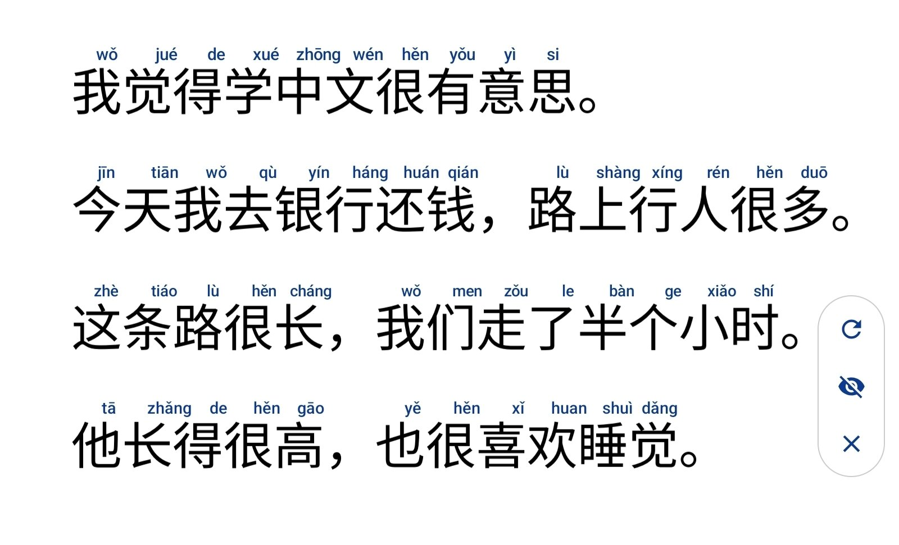

# Rubify

Rubify is an Android app that shows pinyin above the Chinese characters on your screen, to help with reading while you study Mandarin.

Tap the system **accessibility button** and Rubify takes a silent screenshot, recognizes the hanzi on it, and draws the pinyin for each character right above it. You don't leave the app you're reading in, and you don't take screenshots by hand. It works in ordinary apps (browser, WeChat, PDF readers) and on book pages opened in Samsung Notes.



Recognition isn't perfect. Here 47 of the 48 syllables are right, but the 觉 in 睡觉 was read as the look-alike 党, so it shows dǎng instead of jiào. See [Known limits](#known-limits).

## How it works

```
accessibility button tap
  -> AccessibilityService.takeScreenshot()      silent, no dialog or notification
  -> ML Kit Text Recognition v2 (Chinese)       on-device; one bounding box per character
  -> word segmentation + pinyin lookup          in-app dictionary; picks the word's reading for polyphonic characters (多音字)
  -> TYPE_ACCESSIBILITY_OVERLAY window          pass-through, so touches reach the app below
```

- Along with the pinyin comes a small floating bubble you can drag anywhere. It remembers its spot, relative to the screen, across rotations and restarts.
  - **↻ Refresh** reads the screen again, for example after you scroll.
  - **Eye** hides the pinyin or brings the same pinyin back, without reading again.
  - **✕ Close** ends the session. Tapping the accessibility button again does the same.
- Rotating the screen hides the pinyin, because it no longer lines up. Use Refresh to bring it back.
- The **Rubify Quick Settings tile** does the same as the accessibility button. It's for full-screen apps, which hide the navigation bar and the accessibility button with it. Tapping the tile closes the Quick Settings panel and then reads the screen. The tile shows "Pinyin on" while a session is active. On Android 13+, the app's main screen can add the tile for you.

## Status

Early development. Done so far:

| Phase | Scope | State |
| --- | --- | --- |
| 1 | Service skeleton: registers the accessibility button and logs taps | Done, verified on device |
| 2 | Screen capture with `takeScreenshot()`, debug builds save PNGs | Done, verified on device |
| 3 | OCR with ML Kit (Chinese), per-character bounding boxes | Done, verified on device |
| 4 | Pinyin with correct tones, with word segmentation | Done, verified on device |
| 5 | Overlay aligned to characters, adjusted for scale and DPI | Done, verified on device |
| 6 | Toggle on second tap, Quick Settings tile | Done, verified on device (including full screen). The bubble's hide button replaces the planned auto-hide timeout |
| 7 | Robustness: rotation, scroll and zoom | Done, verified on device: rotation hides the pinyin and keeps the bubble in place, and Refresh reads portrait or landscape. After scrolling or zooming, you tap Refresh |
| 8 | Publishing prep: consent screen, store disclosure, Play declaration form | Done, verified on device. GitHub releases are automated. The Play listing is pending |

Not in the MVP: a pipeline that pre-renders pinyin into PDFs, live OCR of handwritten S Pen ink, Cantonese, full translation, and a live camera mode.

## Install

- **GitHub Releases:** download `rubify-<version>-arm64-v8a.apk` from this repository's latest release, or the `universal` APK if unsure. See the Play Protect note below.
- **Google Play:** planned.

After installing, open Rubify, agree to the disclosure, and turn Rubify on in accessibility settings.

> **Upgrading from v0.1?** v0.2 moved the application ID from `com.rubify` to `io.github.v_inn.rubify`, so Android treats it as a different app. Uninstall v0.1 first; consent and the bubble's position don't carry over.

Every release ships a `SHA256SUMS.txt` next to the APKs, so a download can be checked with `sha256sum -c SHA256SUMS.txt`. All releases are signed with the same key, whose certificate fingerprint is:

```
SHA-256: 64:6C:C4:FA:CF:C8:CC:11:30:FF:72:B7:AB:63:EF:CA:0E:D7:05:E5:EC:A3:3D:24:12:5A:3B:30:B5:C0:A2:FF
```

```sh
apksigner verify --print-certs rubify-<version>-universal.apk
```

The v0.2 APKs are also on VirusTotal, which reports every engine's verdict on that exact file: [universal](https://www.virustotal.com/gui/file/b4c24056665d8c9690032b9d4e90906ebf787316e7438a1f41aabbd624ac0359), [arm64-v8a](https://www.virustotal.com/gui/file/f38b34131673e192a9aa596c32754bc6bbb96458a41c1638ed198e8558e6029c). Any release APK can be looked up the same way, by pasting its SHA-256 from `SHA256SUMS.txt` into VirusTotal's search.

> **Blocked by Play Protect?** In some countries, including Brazil, Google Play Protect blocks installing apps that use an accessibility service when they come from a browser, file manager or chat app. The message is "App blocked to protect your device", and there's no option to continue. Until Rubify is on Google Play, install it from a computer with USB debugging turned on:
>
> ```sh
> adb install rubify-<version>-arm64-v8a.apk
> ```
>
> Play Protect doesn't block this way of installing. Android may still grey out the accessibility toggle, though (see below). Installer apps such as [Obtainium](https://github.com/ImranR98/Obtainium) may be blocked in the same way.

> **Greyed out?** Android 13 and newer block accessibility for apps installed outside an app store, including with `adb install`. Open **Settings → Apps → Rubify → ⋮ → Allow restricted settings**, then turn Rubify on. The app's main screen has an **Open app info** shortcut for this.

## Requirements

- Android 11 (API 30) or newer, the minimum for `takeScreenshot()`
- To build: JDK 17+ and an Android SDK with platform 36

## Build and install

```sh
./gradlew assembleDebug          # app/build/outputs/apk/debug/app-debug.apk
./gradlew installDebug           # install on a connected device
./gradlew testDebugUnitTest lintDebug
./gradlew bundleRelease          # app/build/outputs/bundle/release/app-release.aab (R8, signed if configured)
```

Release signing reads `rubifyKeystoreFile`, `rubifyKeystorePassword`, `rubifyKeyAlias` and `rubifyKeyPassword` from `~/.gradle/gradle.properties`. Without them, the release build is left unsigned.

Create `local.properties` with `sdk.dir=/path/to/Android/Sdk` if `ANDROID_HOME` is not set.

## Try it on a device

1. Install the debug build and open **Rubify**. The disclosure opens first. Read it and tap **Agree and continue**. Until you agree, the service doesn't read the screen: tapping the button or tile opens the disclosure instead.
2. Tap **Open accessibility settings**, enable **Rubify**, and allow it.
3. Optional: tap **Add Quick Settings tile** (Android 13+), or add the Rubify tile yourself by editing Quick Settings.
4. If the system asks, assign the accessibility button (or gesture) to Rubify. If another service also uses the button, each tap opens a menu: pick Rubify. The capture waits 400 ms so the menu is gone by then.
5. Watch the log, then tap the accessibility button or the tile:

   ```sh
   adb logcat -s Rubify
   ```

   Pinyin appears above the characters, with the control bubble at the right edge. Each reading logs `Accessibility button clicked` (for button taps), `Screenshot <width>x<height>`, `OCR in <ms> ms: <lines> lines, <n> hanzi`, `Pinyin in <ms> ms`, and `Overlay shown with <n> labels`. Debug builds also log every recognized line with its pinyin, like `你(nǐ)好(hǎo)` (`-s Rubify:D`), and each character with its box and confidence (`-s Rubify:V`). 
6. Pull the debug images and compare them with the screen:

   ```sh
   adb shell run-as io.github.v_inn.rubify ls files/debug-images
   adb exec-out run-as io.github.v_inn.rubify cat files/debug-images/<id>-screenshot.jpg > shot.jpg
   adb exec-out run-as io.github.v_inn.rubify cat files/debug-images/<id>-ocr.jpg > ocr.jpg
   ```

   `-ocr.jpg` is the screenshot with OCR boxes drawn on it (lines in blue, hanzi in red, other characters in gray) and each hanzi's pinyin above its box. Debug builds keep the images of the 5 newest captures. Release builds never write them to disk.

Tapping the accessibility button during a reading cancels it. The system allows only about one screenshot per second (`INTERVAL_TIME_SHORT` in the log). Rubify retries a failed capture up to twice.

On a Galaxy Tab S9 FE, OCR of a full 1600x2560 screen takes about 550 ms, and pinyin for the whole page about 10 ms. The dictionary loads once, in about 1.7 s, when the service starts. On a printed textbook page in a brush-style (kai) font, about 95% of characters were read correctly. The confidence score is too noisy to filter out the errors.

## Known limits

- **Scrolling and zooming aren't followed automatically.** The pinyin stays where it was until you tap Refresh. Samsung Notes reports no scroll events, and the other ways to notice movement (content-change events, repeated screenshots) would weaken the privacy story.
- **Switching apps doesn't hide the pinyin.** It stays on top of the next app until you close it or tap the button or tile, for the same reason.
- **Recognition isn't 100% accurate.** When OCR mistakes a character for a look-alike, you get the pinyin of the wrong character. Clear printed text comes out mostly right, as in the screenshot at the top. Brush-style (kai) fonts, common in textbooks, are the hardest: on one textbook page, about 95% of characters were right. A mistake often changes or goes away if you move the page a little and tap Refresh.

  

  In this textbook excerpt, 候 was read as 侯 (hóu, twice), 面 and 几 as 而 and 儿 (ér), and 便 as 使 (shǐ). 啡 was split in two, so 咖啡 got three syllables.

## Pinyin

Rubify has its own small pinyin engine, because TinyPinyin, the library the plan suggested, has no tones.

- Each run of hanzi is split into words by maximum probability, using jieba's word frequencies (a unigram model). Each word then gets its phrase reading, and characters outside a known phrase get their default reading. This is how 银行 becomes yín háng, 行人 becomes xíng rén, and 我的确不知道 keeps dí què while 你的确认信息 gets de.
- Readings use tone marks and citation tones. 一 and 不 are always shown as yī and bù, with no tone sandhi (the source data applies sandhi inconsistently). A particle 了 is le and a structural 的 is de.
- Known limits:
  - Uncommon words that jieba doesn't know fall back to their characters' default readings. A curated list covers common ones (还书 huán shū, 长得 zhǎng de).
  - A standalone 过 reads guò, even as an aspect particle.
  - OCR mistakes carry through to the pinyin.

The dictionary lives in `app/src/main/assets/pinyin/`. It's generated, so don't edit it by hand. To rebuild it (Python 3, downloads pinned sources):

```sh
python3 tools/pinyin-data/build_pinyin_assets.py
```

Sources, all MIT licensed (notices ship in `assets/pinyin/LICENSES.txt`): [mozillazg/pinyin-data](https://github.com/mozillazg/pinyin-data), [mozillazg/phrase-pinyin-data](https://github.com/mozillazg/phrase-pinyin-data), and the dictionary of [fxsjy/jieba](https://github.com/fxsjy/jieba).

## Privacy

- Before first use, Rubify shows a disclosure and asks for your consent. You can withdraw it under **Privacy and consent**.
- Full privacy policy: <https://v-inn.github.io/Rubify/privacy/>. It's linked from the disclosure and the main screen.
- Rubify reads the screen only when you tap: the accessibility button, the Quick Settings tile, or Refresh (or Show, after a rotation) on its bubble. Starting from the tile also closes the Quick Settings panel, using the accessibility "dismiss notification shade" action (Back on Android 11). It subscribes to no accessibility events and cannot read window content.
- The pinyin and the bubble live in accessibility overlay windows. The pinyin window ignores touches, so everything you do goes to the app underneath. Only the bubble itself takes touches.
- Everything runs on the device, with the OCR model bundled in the app. The app does not request the `INTERNET` permission. ML Kit's library asks for it (to send usage stats), so the manifest removes it, and the build fails if any network permission shows up.
- Screenshots stay in memory and are discarded after processing (debug builds are the only exception, see above). Backup and device transfer are disabled.

## Project layout

```
app/src/main/java/io/github/v_inn/rubify/
  MainActivity.kt                      status, enable, tile, privacy, licenses
  LicensesActivity.kt                  open-source notices
  consent/Consent.kt                   disclosure consent flag (versioned)
  consent/ConsentActivity.kt           prominent disclosure and consent
  service/RubifyAccessibilityService.kt  button callback, windows, capture -> OCR -> pinyin
  service/ReadingSession.kt            when to read and what to show (pure Kotlin)
  capture/ScreenCapturer.kt            takeScreenshot() into a software bitmap
  ocr/HanziRecognizer.kt               ML Kit Chinese text recognition
  ocr/OcrPage.kt                       OCR result model (pure Kotlin), isHanzi()
  pinyin/PinyinDictionary.kt           compact dictionary (pure Kotlin)
  pinyin/WordSegmenter.kt              max-probability word segmentation
  pinyin/PinyinAnnotator.kt            per-character pinyin for a line
  pinyin/PinyinAssets.kt               loads the dictionary from assets
  overlay/PinyinLayout.kt              label placement and sizing (pure Kotlin)
  overlay/PinyinOverlay.kt             full-screen, touch-through pinyin window
  overlay/ControlBubble.kt             draggable refresh / hide / close bubble
  tile/ReadingTileService.kt           Quick Settings tile
  debug/DebugImageStore.kt             debug-only JPEG dumps
  debug/OcrDebugRenderer.kt            draws OCR boxes for inspection
app/src/main/assets/pinyin/          generated pinyin dictionary
app/src/main/res/xml/accessibility_service_config.xml   service capabilities
tools/pinyin-data/                   dictionary build script
site/                                website and privacy policy (GitHub Pages)
```

## Releasing

Every push to `main` and every pull request runs `.github/workflows/ci.yml` (debug build, unit tests, lint). The website has its own workflow (see below).

To publish a GitHub release, push a tag `vX.Y` that matches `versionName`. `.github/workflows/release.yml` then tests, lints and builds signed APKs, and publishes them with a `SHA256SUMS.txt`:
- `rubify-<version>-arm64-v8a.apk` (most devices)
- `-armeabi-v7a`
- `-x86_64` and `-x86` (emulators, some Chromebooks)
- `-universal`

1. One-time: add the signing key as repository secrets (**Settings → Secrets and variables → Actions**):
   ```sh
   base64 -w0 /path/to/upload.jks | gh secret set RUBIFY_KEYSTORE_BASE64
   gh secret set RUBIFY_KEYSTORE_PASSWORD
   gh secret set RUBIFY_KEY_ALIAS
   gh secret set RUBIFY_KEY_PASSWORD
   ```
   The workflow refuses to publish without them. Secrets never reach pull requests from forks.
2. Bump `versionCode` (+1) and `versionName` in `app/build.gradle.kts`, and commit.
3. Tag and push: `git tag v0.2 && git push origin v0.2`.

To build the same APKs locally: `./gradlew assembleRelease -PrubifyAbiSplits=true`. They're signed when the `rubifyKeystore*` properties are set.

The APKs use the same upload key as the Play bundle. Play re-signs its copies, so switching between a GitHub install and a Play install requires uninstalling first.

## Website and privacy policy

`site/` holds a small static site: a landing page and the privacy policy at `/privacy/`, which is the URL to give Play. It uses plain HTML and CSS with no third-party requests. `.github/workflows/pages.yml` publishes it to GitHub Pages on every push to `main` that touches `site/`, and can also be started by hand.

Personal details aren't stored in the repository. The workflow fills them in from repository variables at deploy time.

One-time setup:
1. **Settings → Pages → Build and deployment → Source:** choose **GitHub Actions**.
2. **Settings → Secrets and variables → Actions → Variables:** add `RUBIFY_DEVELOPER_NAME` and `RUBIFY_CONTACT_EMAIL`. Both appear on the public page. The deploy fails while either is missing.
3. Run the **Pages** workflow, from the Actions tab or by pushing a change to `site/`. The policy is then at <https://v-inn.github.io/Rubify/privacy/>. The app links there through the `privacy_policy_url` string, so update that string if the repository or owner changes.

Preview locally:

```sh
REPO_URL=https://github.com/<owner>/Rubify DEVELOPER_NAME="Your Name" CONTACT_EMAIL=you@example.com \
  python3 site/render.py /tmp/rubify-site   # then open /tmp/rubify-site/index.html
```

Open-source notices are shown in the app under **Open-source licenses**.

Contributor and agent guardrails live in [AGENTS.md](AGENTS.md).

## License

Rubify is licensed under the [Apache License 2.0](LICENSE). Bundled data and libraries keep their own licenses: see **Open-source licenses** in the app, `app/src/main/assets/NOTICES.txt`, and `app/src/main/assets/pinyin/LICENSES.txt`. Google ML Kit is used under the [ML Kit Terms of Service](https://developers.google.com/ml-kit/terms).
